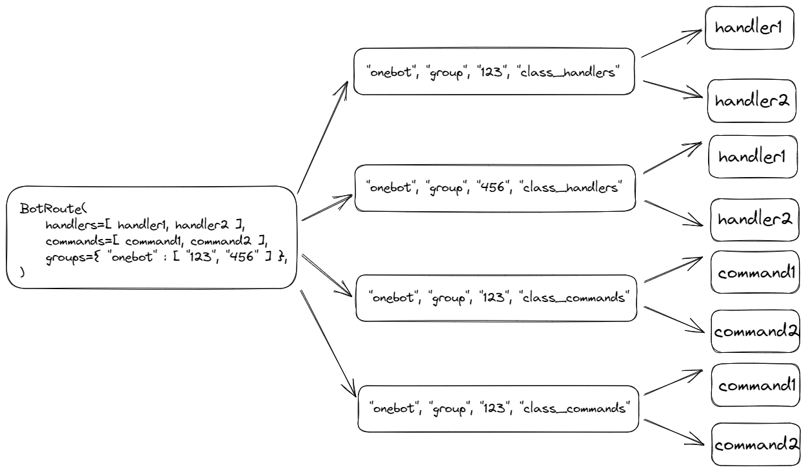

## `PepperBot`是如何解析路由的


从图中可以看出

- 针对每一种bot协议(onebot=>qq，keaimao=>微信)
- 针对每一种会话类型(私聊，群聊，频道)
- 针对每一种handler类型(event_handler、command)

都进行了一次路由解析，最终得到了一个路由映射关系

有了路由映射之后，当我们接收到事件时，就可以根据路由映射，找到对应的handler，然后执行handler

## 缓存class的实例

在解析路由的时候，我们会缓存class的实例，这样可以避免每次都要实例化class，提高性能

## 缓存bot实例

在解析路由的时候，我们会为每一个消息来源缓存bot实例，这样可以避免每次都要实例化bot，提高性能

为什么需要bot实例呢？因为`PepperBot`会将一些事件相关的参数，直接绑定到`bot实例`上，这样的话，调用api时，`PepperBot`可以直接从`bot实例`上获取到这些参数，从而避免了每次都要传递这些参数

```python

# 手动传参数
# 这里只是举个例子，这个api在pepperbot里面是不存在的
await bot.send_message(
    Text('hello'),
    message_type='group',
    group_id="123",
)


# 自动从bot实例上获取参数，不需要手动传递了
await bot.send_message(
    Text('hello'),
)

```
