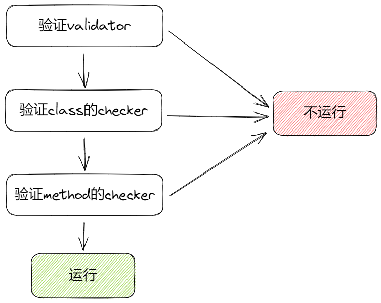

## `PepperBot`如何实现权限控制

在`PepperBot`中，可以通过`validator`型路由，实现路由级别的权限控制

也可以通过`available`装饰器，实现class级别、method级别的权限控制

### `validator`型路由和`available`的区别

在[路由](../event/route)中，我们介绍了`validator`型路由

validator，针对一组handler或者command，

如果校验通过，该组皆可用

available，针对单个handler method或者command method，

如果校验通过，该handler或者method允许执行

使用validator的典型场景，说人话就是

- 假设你的用户分为普通用户和超级用户
- 假设你有10个指令，其中5个所有用户都可以用，另外5个只有超级用户能用
- 这种场景，就适合用validator实现，设置2个BotRoute，其中一个匹配任意用户，另一个，通过validator校验用户是否为超级用户，给予使用权限
- 这种场景，如果用available实现，则你需要为那5个(甚至更多)仅有超级用户能用的指令，每个都套一遍available，太麻烦了

```python
[
  BotRoute(
   commands=[Command1, Command2, ...],
   friends="*"
  ),
  BotRoute(
   commands=[Command6, Command7, ...],
   friends=[is_super_user],
  ),  
]
```

使用available的典型场景，说人话就是

- 你仅有少数几个command需要鉴权
- 你需要method精度的权限控制(不同的method可以应用不同的checker)
  - validator只能class精度

比如，你想对command实现次数限制，普通用户5次，超级用户不限次

也就是说，这个command是所有用户都可以使用的(都可以触发)，也就是不进行class精度的鉴权

这种场景，就比较适合对command中，具体实现业务逻辑的method进行鉴权

```python
@as_command(...)
class MyCommand:
    @available(rate_limit)
    async def initial(self, ...):
        ...
        return self.initial
```

根据自己的需求，这两者可以结合使用

### `available`的构成

`available`是一个装饰器，可以向该装饰器传入一个或多个`checker`

`checker`可以是同步的，也可以是异步的

每个`checker`都需要返回一个`bool`值，表示是否通过校验

## TODO 必须显式返回bool值，会通过AST检查checker的代码，如果不是bool，会报错

如果`checker`抛出异常，会被忽略，也就是视为校验成功

同一个`available`接受的多个`checker`之间，是并发执行的

## `available`的可用性

作为一个符合直觉的框架，你可以用同一个`available`装饰器，同时应用的`class_handler`和`class_command`的class、method上

### class handler的class上

```python
@available(checker1, checker2, ...)
class MyHandler:
    ...
```

### class handler的method上

```python
@available(checker1, checker2, ...)
class MyHandler:

    @available(checker3, checker4, ...)
    async def group_message(self, ...):
        ...
```

### class command的class上

```python
@available(checker1, checker2, ...)
@as_command(...)
class MyCommand:
    ...
```

或者

```python
@as_command(...)
@available(checker1, checker2, ...)
class MyCommand:
    ...
```

不讲究应用available的顺序

### class command的method上

```python
@available(checker1, checker2, ...)
@as_command(...)
class MyCommand:

    @available(checker3, checker4, ...)
    async def initial(self, ...):
        ...
```

#### initial

对`initial`生命周期应用`available`比较特殊

因为`initial`是指令的入口，所以会先验证是否满足前缀，

满足前缀，才会进入到`initial`的`available`校验

如果此时指令尚未运行，如果校验失败，会继续对其他指令进行判断，看看是否有可用的指令

如果此时该指令已经运行，如果校验失败，那就失败了，不会继续对其他指令进行判断

因为对于同一种交互策略(锁定用户的话，就是同一个用户，或者锁定群=>同一个群)，同一时间，`PepperBot`只允许有一个运行中的指令

#### 其他method

如果能够触发除`initial`以外的method，说明当前的指令，已经在运行中了

此时，如果校验成功，会正常执行对应的method

如果校验失败，指令的指向不会改变，也就是说，下一次触发该指令时，还是会执行相同的method

需要注意的是，哪怕`available`校验失败，也会修改指令的`update_time`，这个`update_time`，是用来判断指令是否超时的

#### 生命周期

TODO 不允许对生命周期应用`available`，在启动`PepperBot`时，会通过AST检查代码，如果发现有这种情况，会报错

### “最难走的路”

假设你应用了`validator`型路由，对`class_command`的class上应用了`available`，对`class_command`的method上应用了`available`

那么如图，就是需要经历的流程



## `checker`的参数

一贯的`PepperBot`风格

- 只需要列出需要的参数即可，动态注入
- 必须提供类型

### 所有`checker`都会接受的参数

per_event

per_propagation_group

:::warning
还没想好这个怎么实现
:::

### `class handler`的`event handler`(比如`group_message`)的`checker`会接受的参数

和正常的`event handler`一样，查看[事件一览]即可

### `class command`的`method`的`checker`会接受的参数

和正常的`method`一样，查看[指令]部分即可

## 手动用装饰器实现权限控制

这里的概念，比较深入，需要你对python的装饰器有一定的了解

需要手动处理参数

不管在`available`之前还是之后应用自己的装饰器，都会在检查完`available`的`checker`之后，才会执行自己的装饰器
