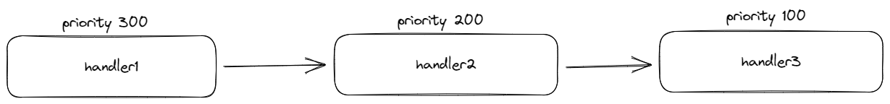
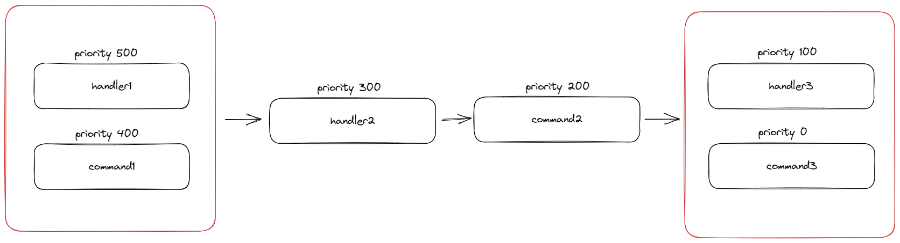
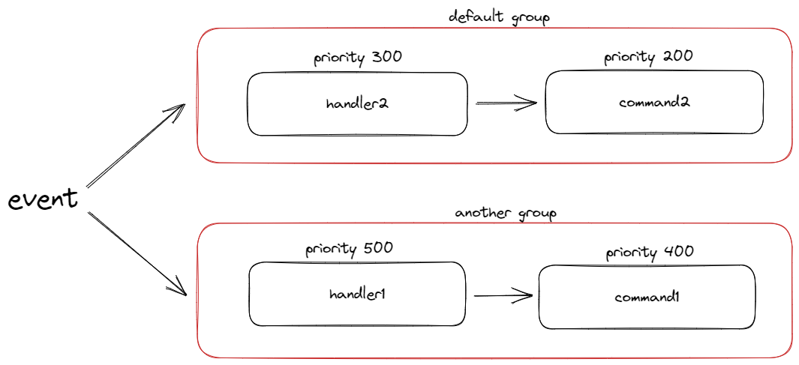

当我们有很多`handler`、`command`时，很可能有这样的场景

- 我希望实现一个拦截性质的`handler`，对事件进行预处理，只有满足要求时，才放行给后续的其他`handler`处理
- 我希望实现选择性的执行某些`handler`，当执行了其中任何一个，就放弃执行其他的`handler`

接下来，我们将介绍如何实现第一条，第二条如何实现，见[权限控制](./available)

## `PepperBot`的事件传播机制



当接受到一个事件时，`PepperBot`会将所有可用的`handler`、`command`，按照`priority`进行排序，`priority`越大，越靠前

默认情况下，如果没有任何`handler`、`command`阻断事件的传播(stop propagation)，那么就依次执行

如果有`handler`、`command`阻断了事件的传播，那么就不会执行后续的`handler`、`command`

但是，有一个前提，就是`handler`、`command`必须设置`concurrency`为`False`

### `handler`的并发执行

对于大多数的使用场景来说，我们希望`handler`是并发执行的，这样可以提高性能

如果不并发(也就是顺序执行)，会是什么样子呢？

假设我们有一个比较耗时的、并且是阻塞的`handler`，那么直到这个`handler`执行完毕，`PepperBot`才会继续执行后续的`handler`

如果`handler`之间并没有逻辑上的联系(也就是说，无所谓执行的先后顺序)，那么这样的执行方式，显然会显著的降低响应速度(因为要等待之前的`handler`执行完毕)

### `PepperBot`如何处理，同时存在`并发执行`与`顺序执行`的情况

假设我们有这样几个`handler`、`command`

| priority | concurrency | type | name |
| --- | --- | --- | --- |
| 500 | True | class_handler | handler1 |
| 400 | True | class_command | command1 |
| 300 | False | class_handler | handler2 |
| 200 | False | class_command | command2 |
| 100 | True | class_handler | handler3 |
| 0 | True | class_command | command3 |



可以看到，`handler2`、`command2`是顺序执行的，而其他的`handler`、`command`是并发执行的

同时，因为`handler1`、`command1`的`priority`比`handler2`、`command2`大，所以`handler1`、`command1`会先于`handler2`、`command2`执行

因为`handler2`、`command2`是非并发的，所以`handler3`、`command3`会在`handler2`、`command2`执行完毕后，才会执行

或者换句话说，如果在按照`priority`排序后的handler中，如果存在非并发的handler，则会在执行该handler之前，会等待该handler之前所有的并发handler执行完毕

### 顺序执行以实现事件传播的控制

只有当一个`handler`或者`command`执行完成，我们才能知道，该`handler`是否阻断了事件的传播

从上图可以看到，`handler1`、`command1`是并发执行的，所以假设`handler1`阻断了事件的传播，因为并发(同时)执行的原因，此时`command1`已经执行了，所以此时`stop propagation`并未起效，虽然`handler1`的`优先级`比`command2`的高

但是，对于`handler2`来说，它是顺序执行的，所以在`handler2`执行之前，会等待`handler1`执行完毕，此时，如果`handler1`阻断了事件的传播，那么`handler2`就不会执行了

所以总结一下，如果我们希望实现事件传播的控制，那么我们可以将`handler`、`command`设置为顺序执行，这样就可以在`handler`、`command`执行完毕后，知道是否阻断了事件的传播

## 通过对传播进行分组，避免干扰

回到我们一开始假设的场景

> 我希望实现一个拦截性质的`handler`，对事件进行预处理，只有满足要求时，才放行给后续的其他`handler`处理

如果我的这个`拦截handler`，只想作用于后续的`handler2`，而完全不关心其他的`handler`

假设此时`拦截handler`阻断了传播，虽然确实实现了拦截`handler2`的执行，但是同时，也影响了其他的`handler`

那么，我们可以通过对传播进行分组，来避免这种干扰



现在，当`拦截handler`阻断了传播时，只会影响同一个`传播组`中的`handler2`，而不会影响到其他传播组

多个`传播组`之间，既然没有了逻辑上的联系，自然也是并发执行的

## 具体如何设置

- `priority`默认为`0`
- `concurrency`默认为`True`
- `propagation_group`默认为`default`

### 设置`class_handler`

```python
from pepperbot.store.event import PropagationConfig

class MyHandler:
    config = PropagationConfig(
        priority=100,
        concurrency=False,
        propagation_group="test",
    )

    async def group_message(self, ...):
        ...
```

### 设置`class_command`

```python
@as_command(
    ...
    priority=100,
    concurrency=False,
    propagation_group="test",
)
class MyCommand:
    ...
```
