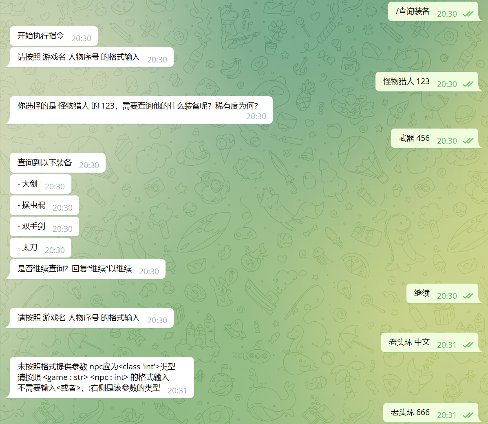
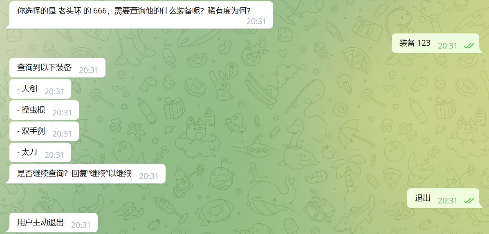

## 一个小目标

这一章，我们的最终目标，是实现如下的对话效果

<!--

-->

import { Conversation } from "@site/src/components/Conversation";

<Conversation
    messages={[
        {
            position: "right",
            sender: "用户",
            message: "/查询装备",
        },
        {
            position: "left",
            sender: "bot",
            message: "开始执行指令",
        },
        {
            position: "left",
            sender: "bot",
            message: "请按照 游戏名 人物序号 的格式输入",
        },
        {
            position: "right",
            sender: "用户",
            message: "某游戏 某人物",
        },
        {
            position: "left",
            sender: "bot",
            message: "格式错误，请按照xxxxxx的格式，输入",
        },
        {
            position: "right",
            sender: "用户",
            message: "某游戏 9527",
        },
        {
            position: "left",
            sender: "bot",
            message: "你选择的是 某游戏 的 某人物，需要查询他的什么装备呢？稀有度为何？",
        },
        {
            position: "right",
            sender: "用户",
            message: "武器 5",
        },
        {
            position: "left",
            sender: "bot",
            message: "查询到以下装备",
        },
        {
            position: "left",
            sender: "bot",
            message: "- 大剑",
        },
        {
            position: "left",
            sender: "bot",
            message: "- 操虫棍",
        },
        {
            position: "left",
            sender: "bot",
            message: "- 双手剑",
        },
        {
            position: "left",
            sender: "bot",
            message: "- 太刀",
        },
        {
            position: "left",
            sender: "bot",
            message: "是否继续查询？回复“继续”以继续",
        },
        {
            position: "right",
            sender: "用户",
            message: "不",
        },
        {
            position: "left",
            sender: "bot",
            message:
                "指令自然退出，历史成功消息如下\n\
----------\n\
第1次对话\n\
用户输入 : /查询装备\n\
解析出如下参数\n\
----------\n\
第2次对话\n\
用户输入 : 某游戏 某人物\n\
解析出如下参数\n\
<game : str> : 某游戏\n\
<npc : str> : 某人物\n\
----------\n\
第3次对话\n\
用户输入 : 某人物 传说\n\
解析出如下参数\n\
<kind : str> : 武器\n\
<clarity : int> : 5\n\
----------",
        },
    ]}
/>

我们来拆解一下，实现一个这样的指令，我们需要涉及哪些方面

`as_command`完整参数文档[在此](./config.mdx)

## 完整指令

import CodeBlock from "@theme/CodeBlock";
import MyComponentSource from "!!raw-loader!../../../../demos/示例/查询装备.py";

{/* <CodeBlock className="language-py">{MyComponentSource}</CodeBlock> */}

<!--import Content from "../../../../README.md";

<Content />
-->
