## 会话的概念

为了实现高级的指令功能，我们引入了会话的概念

什么叫会话呢？从用户触发指令开始，到指令结束之间的完整过程，就是一个会话了

在指令会话的不同阶段，我们抽象出了一系列的“钩子”，在会话执行到该阶段时，自动触发，称之为“生命周期”

## 生命周期的意义

如果你用过 Vue，对 PepperBot 的生命周期一定很眼熟，事实上，PepperBot 的生命周期，就是学习自 Vue

比如 Vue 中的`created`, `mounted`，在 PepperBot 中对应的就是 `initial`

`destroyed`对应 PepperBot 中的 `finish`, `exit`

得益于生命周期，我们可以轻松定义出灵活、高可读性的指令

完整的生命周期及参数，[见此]

## 对比try except else finally

其实，`catch`、`finish`、`cleanup`基本上效果和python自带的`except`、`else` 、`finally`是一样的

之所以名字并未直接命名为`except`、`else` 、`finally`，是因为`except`、`else` 、`finally`是python的关键字，如果用这些作为生命周期的名称，会导致语法错误

假设有这样一段异常捕获

```python
try:
    ...
except Exception as e:
    ...
else:
    ...
finally:
    ...
```

等价的生命周期写法

```python
class MyCommand:
    async def initial(self): # 对应try，任意非catch、finish、cleanup的方法
        ...

    async def catch(self): # 对应except
        ...

    async def finish(self): # 对应else
        ...

    async def cleanup(self): # 对应finally
        ...
```

或者更直观一点

```python
try:
    ...
except CommandTimeout:
    try:
        await MyCommand.timeout()
    except Exception as e:
        await MyCommand.catch(e)
except CommandExit:
    try:
        await MyCommand.exit()
    except Exception as e:
        await MyCommand.catch(e)
except Exception as e:
    await MyCommand.catch(e)
else:
    try:
        await MyCommand.finish()
    except Exception as e:
        await MyCommand.catch(e)
finally:
    await MyCommand.cleanup()
```

如果完全按照python的`try`、`except`、`else`、`finally`的语法，`else`里的`finish`，是不会捕获的

不过为了方便开发者，对于`finish`，我们也会捕获异常

总结一下，就是`catch`，会捕获除了`catch`生命周期自身 + `cleanup`生命周期以外的所有异常，包含`timeout`、`exit`、`finish`

## 入口`initial`

什么是入口？就是当用户触发指令时，我们最先执行的`方法`，即为入口

在 PepperBot 中，入口函数的名称，要求是`initial`

比如我们有一条触发关键词为"今日头条"的指令

那么，当用户发送“今日头条”时，就会自动触发入口`initial`钩子

```py
class 今日头条:
    async def initial(self):
        # 当触发指令时，首先执行initial函数
        ...
```

## 指令超时`timeout`

我们在[声明指令](./define.mdx)的`as_command`装饰器中，可以设置`timeout`参数，当用户超过指定的时长未回复机器人时，会自动触发该钩子

```py
class MyCommand:
    async def timeout(self):
        # 当超时时，触发该钩子
        ...
```

对比异常捕获的话，可以理解为

```python
try:
    ...
except CommandTimeout:
    await MyCommand.timeout()
```

## 用户主动退出`exit`

我们在[声明指令](./define.mdx)的`as_command`装饰器中，可以设置`exit`参数，`exit`为一个列表，其中每一个元素，都应是一个正则表达式，当用户输入的纯文字内容(即`chain.pure_text`)满足任意一个正则时，触发`exit`钩子

```py
class MyCommand:
    async def exit(self):
        # 当用户主动退出时，触发该钩子
        ...
```

对比异常捕获的话，可以理解为

```python
try:
    ...
except CommandExit:
    await MyCommand.exit()
```

## 异常捕获`catch`

在执行指令的任意`handler`(除`catch`以外的任意生命周期，或者所有用户定义的`方法`)时，如果触发异常，如果用户定义了`catch`，那么则会执行该钩子，有点像是 react 的`error boundary`

在执行`catch`生命周期后，根据`catch`函数的返回指向，可以继续执行指令，也可以直接结束指令，具体见[声明指令](./define.mdx)

```py
class MyCommand:
    async def catch(self):
        # 当其他handler执行出错时，触发该钩子
        ...
```

对比异常捕获的话，可以理解为

```python
try:
    ...
except CommandTimeout:
    try:
        await MyCommand.timeout()
    except Exception as e:
        await MyCommand.catch(e)
except CommandExit:
    try:
        await MyCommand.exit()
    except Exception as e:
        await MyCommand.catch(e)
except Exception as e:
    await MyCommand.catch(e)
```

## 指令自然终止`finish`

如果我们的指令，在执行过程中，用户响应没有超时，用户也没有主动退出，指令执行也没有出现任何异常，那么，就会触发指令的`自然终止`钩子

```py
class MyCommand:
    async def finish(self):
        # 当指令自然退出时，触发该钩子
        ...
```

对比异常捕获的话，可以理解为

```python
try:
    ...
else:
    await MyCommand.finish()
```

## 指令清理`cleanup`

类似于`finally`，指令执行完毕后，会自动触发`cleanup`钩子

```py
class MyCommand:
    async def cleanup(self):
        # 当指令执行完毕后，触发该钩子
        ...
```

对比异常捕获的话，可以理解为

```python
try:
    ...
finally:
    await MyCommand.cleanup()
```

## 复用生命周期的定义

PepperBot 的指令，是基于`class`的，所以，我们可以基于 `mixin`，实现生命周期的复用

比如，我们定义了比较通用的生命周期`mixin`

```py
class CommonMixin:
    # 用户主动退出
    async def exit(self):
        ...

    # 流程正常退出(在中间的流程return None也是正常退出)
    async def finish(self):
        ...

    async def timeout(self):
        ...
```

现在，当我们定义不同的指令时，就可以复用生命周期了

```py
class 指令1(CommonMixin):
    ...

class 指令2(CommonMixin):
    ...
```

当指令混入 mixin 后，已经定义的`方法`是可以覆盖的

比如，我们想在`指令1`中，自定义一下`exit`钩子，那么，我们只需要

```py
class 指令1(CommonMixin):
    async def exit(self):
        ...
```

这样，我们就按照我们的需要，重新定义了`exit`钩子，其它两个未定义的钩子`finish`, `timeout`, 还是保留未被修改的状态，也就是说，“合并了”
