## 原理



一般来说，对接是双向的

当`协议端`收到新的事件时，`协议端`会发送到 `PepperBot`

当 `PepperBot` 想要调用 api，比如发送消息时，会发送调用请求到`协议端`

我们都需要配置

:::warning
如果你希望对接协议端，比如 QQ，需要同时运行 go-cqhttp 和 PepperBot

简单来说，就是打开两个窗口，一个运行 go-cqhttp，一个运行 PepperBot，微信等其他平台同理
:::

## 配置 PepperBot 接收端口

```py
bot = PepperBot(
    port=53521,
    debug=True,
)
```

事件接收端口只需要配置一次，所有协议端共用

开启 debug，修改文件(及导入的文件)时，PepperBot 将会自动重启服务

## 协议通信方式支持情况

| 协议\方向 | PepperBot 从协议端接收(接收事件) | PepperBot 发送至协议端(调用 API) |
| --------- | -------------------------------- | -------------------------------- |
| onebot    | websocket                        | http                             |
| keaimao    | http                             | http                             |
| telegram  | 不需要                           | 不需要                            |

## 配置 PepperBot 接受协议和方式

```py
bot.register_adapter(
    bot_protocol="onebot",
    receive_protocol="websocket",
    backend_protocol="http",
    backend_host="127.0.0.1",
    backend_port=5700,
)
```

`bot_protocol`配置协议

`receive_protocol`配置 PepperBot 接收协议端推送事件的方式，根据上方表格设置，`http`或者`websocket`

## 配置协议端 API 的调用方式

```py
bot.register_adapter(
    bot_protocol="keaimao",
    receive_protocol="http",
    backend_protocol="http",
    backend_host="192.168.0.109",
    backend_port=8090,
)
```

- `backend_protocol`配置协议端接收方式
- `backend_host`配置协议端的 ip
- `backend_port`配置协议端的端口

## 自定义事件接收 uri

默认情况下，自动生成的 uri 的格式是`协议/通信方式`

- 通过 websocket 接收 Onebot 后端的事件推送——`/onebot/ws/`
- 通过 http 接收可爱猫的事件推送——`/keaimao/http/`

可以通过给 register_adapter 提供`receive_uri`参数，自定义接收 uri
