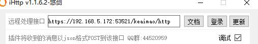

## 安装

需要安装

- 5.X 版本的可爱猫
- 可爱猫的 iHTTP 插件
- 指定版本的微信

可以添加交流群获取

## 配置

1. 从可爱猫启动指定版本的微信
2. 登录微信
3. 配置 iHTTP 的 url 与 PepperBot 中配置的一致

远程处理接口和PepperBot配置一致



```py
bot = PepperBot(
    port=53521,
    debug=True,
)
```

内网地址和`adapter`一致


```py
bot.register_adapter(
    bot_protocol="keaimao",
    receive_protocol="http",
    backend_protocol="http",
    backend_host="192.168.5.172",
    backend_port=8090,
)
```
