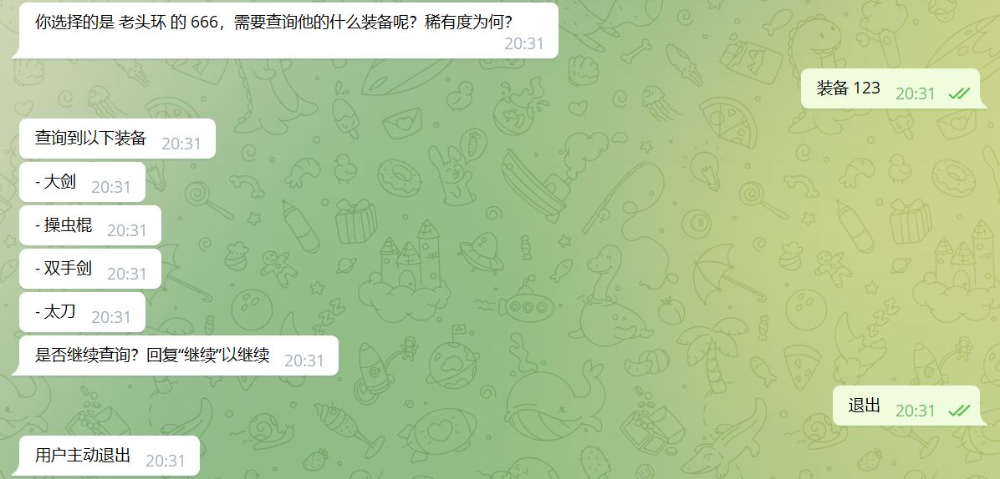

## 一个小目标

这一章，我们的最终目标，是实现如下的对话效果




    用户——/查询装备

    开始执行指令——bot
    请按照 游戏名 人物序号 的格式输入——bot

    用户——某游戏 某人物

    格式错误，请按照xxxxxx的格式，输入——bot

    用户——某游戏 9527

    你选择的是 某游戏 的 某人物，需要查询他的什么装备呢？稀有度为何？——bot

    用户——武器 5

    查询到以下装备
    - 大剑
    - 操虫棍
    - 双手剑
    - 太刀
    ——bot

    是否继续查询？回复“继续”以继续——bot

    用户——不

    指令自然退出，历史成功消息如下
    ----------
    第1次对话
    用户输入 : /查询装备
    解析出如下参数
    ----------
    第2次对话
    用户输入 : 某游戏 某人物
    解析出如下参数
    <game : str> : 某游戏
    <npc : str> : 某人物
    ----------
    第3次对话
    用户输入 : 某人物 传说
    解析出如下参数
    <kind : str> : 武器
    <clarity : int> : 5
    ----------
    ——bot

我们来拆解一下，实现一个这样的指令，我们需要涉及哪些方面

`as_command`完整参数文档[在此]

## 触发指令

想要触发一个指令，我们首先要能满足指令的关键字识别

常见的指令由以下三个部分组成 前缀 + 指令名称 + 参数

比如"/今日头条"，前缀为“/”，指令名称为"今日头条"，没有参数

比如“天气 上海”，没有前缀，或者说前缀为空，即“”，指令名称为“天气”，有一个参数，“上海”

### prefixes

通过`as_command`中的`prefixes`参数，我们可以设置指令的前缀，可以设置多个，也可以一个都不设置

比如指令“今日头条”，我们设置`prefixes`为["/", "@", "#"]，当用户使用任意一个前缀时，都能触发该指令

```py
"/今日头条"
"@今日头条"
"#今日头条"
```

### include_class_name

默认来说，指令的类名，也会被视作指令的名称，比如

```py
class 天气指令:
    ...
```

假设 prefixes 设置为["/"]，当用户输入"/天气指令"时，会触发该指令

这一行为可以设置 include_class_name 为 False 关闭

### aliases

有时候，想要为指令设置多个别名，可以通过`as_command`中的`aliases`参数实现

比如天气指令，当设置`aliases`为["天气", "气象", "风雨"]时，用户输入

```py
"天气 上海"
"气象 北京"
"风雨 深圳"
```

都会触发

配合`include_class_name`使用，可以实现非常灵活的效果

## 校验参数

从上方的例子可以看到，我们实现了参数校验的功能，参数的自动校验和解析，是通过`PatternArg`实现的

参数格式有两点要求

-   参数数量要和定义了的`PatternArg`数量一致
-   参数类型要和对应位置的`PatternArg`一致

比如这样的定义

```py
async def choose_game(self, game: str = PatternArg(), sender: CommandSender, npc : int = PatternArg()):
    sender.send_message(Text(f"你选择的是 {game} 的 {npc}，需要查询他的什么装备呢？稀有度为何？"))
```

我们定义了两个参数，第一个参数为 game，字符串类型，第二个参数为 npc，是 int 类型

可以看到，我们在统计参数的时候，跳过了`sender`这样的保留参数，只统计了默认值为`PatternArg()`的参数

用户输入参数时的顺序，应该和定义的顺序一致，比如，第一个参数因为`game`，第二个参数为`npc`

如果用户输入的参数的类型，与我们定义的不一致，比如

```py
"某游戏 某人物"
```

这里，npc 应该为 int 类型，而我们提供的是字符串"某人物"，那么，当 PepperBot 试图将字符串"某人物"转换为 int 类型时，自然会失败

在 PepperBot 中，当用户的输入不符合要求时，会自动发送格式提示，比如

```py
" <str : xxx>
```

## `initial`钩子与`PatternArg`

事实上，`initial`钩子也可以使用`PatternArg`，这样的话，我们就可以直接一步解析出参数，可以省略掉一次询问的过程，前提是，需要用户已经知道该指令的参数输入规则

```py

```

如果没能满足要求，也就是没有通过参数校验这一关，那么，指令并没有开始会话，该指令并不视为执行状态，自然，`history`中，也就没有该次，用户发送的消息

再次强调，只有成功通过参数校验的`handler`，用户发送的消息才会被注入`history`，这样实现，是为了降低心智负担，即，出现在`history`中的消息，都是满足要求的，和我们自己定义的，不出错时，逻辑的执行顺序是一致的

## 更新指令状态(回滚)

我们定义了几个阶段，首先， 选择游戏，其次，选择装备，那么，怎么将这两个`方法`链接起来呢？

```py
def choose_game():
    ...
    return self.choose_kind

def choose_kind():
    ...
    return self.whether_continue
```

通过`方法`的返回值，返回下一步要执行的函数

```py

def choose_game():
    return self.choose_kind

```

:::warning
注意，返回函数对象

```py
return self.function_name
```

而不是返回函数调用

```py
return self.function_call()
```

:::

不但可以向下跳转，还可以向上跳转

在该示例中，我们实现了继续查询，跳转回上一步

```py
def whether_continue():
    if "继续" in chain:
        return self.choose_game

```

如果没有 return 语句，或者 return None，那么，会触发 finish 钩子

```py
def func():
    ...
    # no return

def func():
    return
    # implicit return None隐式返回None

def func():
    return None

def func():
    return self.finish
```

这四种都等价
自然退出

## 指令超时/退出

通过定义`exit_patterns`，

都是正则表达式，和`prefixes`有点像

满足`exit_patterns`而退出，是用户主动退出，触发的是`exit`钩子

`exit`钩子，无法通过 return self.exit 手动触发

```py


```

## 历史记录，history

如果有参数解析，只有成功解析了参数的用户输入，会被收录

可以通过在函数签名中，定义`history`参数，来获得

```py
async def func(self, history):
    for history_item in history:

```

## CommandSender

可以发现，我们在指令中，并没有使用 bot.group_message 之类的 api，而是 sender.send_message

那么，我们为什么引入 sender 这样一个新概念呢？

sender，其实就是个快捷方式，自动向不同消息来源的对象发送消息的快捷方式

因为作为指令的话，你不知道，用户是从私聊消息，还是从群消息发送的

新引入 sender 对象，通过 sender.send_message，可以自动判断，不需要手动 bot.onebot 之类了

当然，我们在指令中也是可以继续使用 bot.xxx 风格的 api 的，见`arbitrary API`

## 完整指令

import CodeBlock from "@theme/CodeBlock";
import MyComponentSource from "!!raw-loader!../../../../demos/示例/查询装备.py";

<CodeBlock className="language-py">{MyComponentSource}</CodeBlock>
